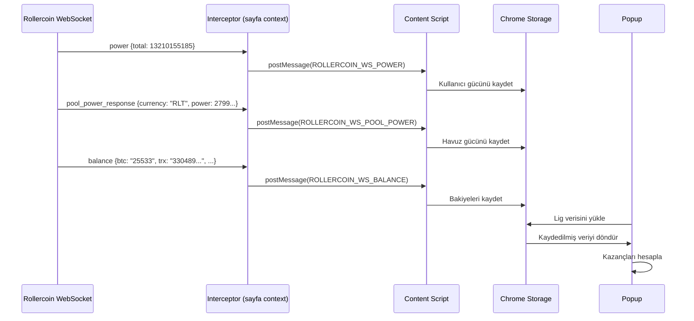

# Rollercoin Kazanç Hesaplayıcı

[🇬🇧 English](README.en.md)

Rollercoin oyununda günlük, haftalık ve aylık kazançlarınızı hesaplayan browser eklentisi.

## Özellikler

- 📊 Tüm coinler için kazanç hesaplama
- 💰 Fiat para birimleri ile değer gösterme (USDT, TRY, EUR, vb.)
- ⏱️ Minimum çekim süreleri hesaplama
- 🔄 WebSocket üzerinden gerçek zamanlı veri
- 💾 Çevrimdışı çalışma (cache'lenmiş veri ile)

## Çalışma Mantığı



## Kurulum

1. Projeyi klonlayın: `git clone https://github.com/user/rollercoin-extension`
2. Bağımlılıkları yükleyin: `npm install`
3. Derleyin: `npm run build`
4. Chrome'da `chrome://extensions` açın
5. "Paketlenmemiş yükle" → `dist` klasörünü seçin

## Kullanım

1. https://rollercoin.com/game sayfasına gidin
2. Eklenti ikonuna tıklayın
3. Kazanç hesaplamalarını görün

## Proje Yapısı

```
src/
├── content/
│   ├── content.ts              # Ana content script
│   └── websocket-interceptor.ts # WebSocket mesaj yakalayıcı
├── background/
│   └── service-worker.ts       # Background service worker
├── popup/
│   ├── App.tsx                 # Popup UI
│   └── components/             # React bileşenleri
└── types/
    └── index.ts                # TypeScript tipleri
```

## Lisans

MIT
