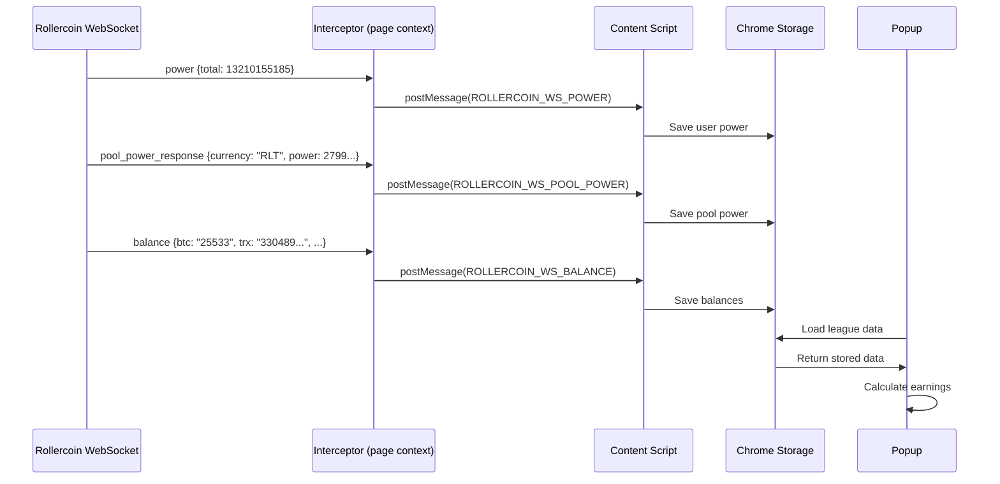

# RollercoinExtension

[TR (Türkçe)](README.tr.md) | [EN (English)](README.md)

---

# Rollercoin Earnings Calculator


[🇹🇷 Türkçe](README.md)

Browser extension that calculates your daily, weekly and monthly earnings in Rollercoin game.

## Features

- 📊 Earnings calculation for all coins
- 💰 Fiat currency conversion (USDT, TRY, EUR, etc.)
- ⏱️ Minimum withdrawal time calculation
- 🔄 Real-time data via WebSocket
- 💾 Offline mode (with cached data)

## How It Works



## Installation

1. Clone the project: `git clone https://github.com/user/rollercoin-extension`
2. Install dependencies: `npm install`
3. Build: `npm run build`
4. Open `chrome://extensions` in Chrome
5. Click "Load unpacked" → Select `dist` folder

## Usage

1. Go to https://rollercoin.com/game
2. Click the extension icon
3. View your earnings calculations

## Project Structure

```
src/
├── content/
│   ├── content.ts              # Main content script
│   └── websocket-interceptor.ts # WebSocket message interceptor
├── background/
│   └── service-worker.ts       # Background service worker
├── popup/
│   ├── App.tsx                 # Popup UI
│   └── components/             # React components
└── types/
    └── index.ts                # TypeScript types
```

## License

MIT
